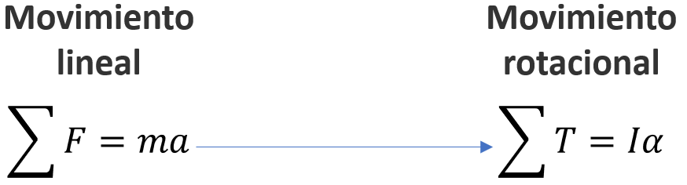

<h1>Aula 2</h1>

Esta clase consiste en entender y aplicar las formulaciones de Newton Euler y Euler Lagrange.

<h2>Newton Euler</h2>

La formulación de Newton-Euler se basa a partir de la Segunda Ley de Newton, la cual relaciona fuerza y momento lineal o torque y momento angular.

 
<figcaption>Fuente: Autor</figcaption>

<h2>Euler Lagrange</h2>

La formulación de Lagrange-Euler describe el comportamiento de un sistema dinámico en términos del trabajo y la energía almacenados en dicho sistema, a través de la energía cinética y potencial. El Lagrangiano es:

$$L(q_i,\dot{q}_i) = E_c - E_p$$

$$Q_i = \frac{d}{dt}(\frac{dL}{d\dot{q}_i})-\frac{dL}{dq_i}$$

$$E_c = \frac{1}{2}mV^2$$

$$E_p = mgh$$

Donde:

$$E_c = Energía cinética$$
$$E_p = Energía potencial$$
$$Q_i = Fuerza generalizada$$
$$q_i = Coordenada generalizada$$
$$i = Grado de libertad$$

<h2>Ejercicios</h2>

